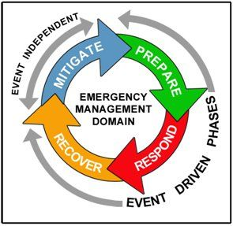

# DEVELOPMENT OF CROSS PLATFORM MOBILE APPLICATION FOR CROWD SOURCING IN DISASTER MANAGEMENT

This project , titled , ***“DEVELOPMENT OF CROSS PLATFORM MOBILE APPLICATION FOR CROWD SOURCING IN DISASTER MANAGEMENT”*** , aims to reduce or avoid the potential losses from hazards, assure prompt and appropriate assistance to victims of disaster, and achieve rapid and effective recovery. Communication during disaster time is very crucial for both rescue team and victim. Emergency never comes with prior intimation. The System is intended to function in case of emergencies in society.The emergencies include Fire, Medical Emergencies, accident and External Emergencies (Earthquake, Floods, Storm). The system works on the principles of client-Server system, wherein the server responds to the requests of the Clients. 
The Disaster management cycle illustrates the ongoing process by which governments, businesses, and civil society plan for and reduce the impact of disasters, react during and immediately following a disaster, and take steps to recover after a disaster has occurred. Appropriate actions at all points in the cycle lead to greater preparedness, better warnings, reduced vulnerability or the prevention of disasters during the next iteration of the cycle. There are 4 phases of the **CDM Cycle** :

   

   
   

This project deals with the Response state of the CDM. It includes the actions carried out in a disaster situation with the objective to save life, alleviate suffering and reduce economic losses. The main tool in response is the implementation of plans which were prepared prior to the event. In this project I have developed a mobile app that can be used as an helpline portal for its users. The app is made in the DART language using the Flutter framework. Hence it is compatible with both Android and iOS. In this project I have used Firebase as the backend service. 

## OBJECTIVE

Communications technologies – including social and mobile tools – plays an ever increasing role in emergency response and rescue efforts , as well as overall personal safety. In order to achieve this aim, the objectives have been formulated as follows :

*To develop a cross platform application for providing emergency assistance.
*For Speeding recovery operations.
*Returning systems to normal level.

## TECHNICAL SPECIFICATION

### FLUTTER

Flutter was launched by Google and is an open-source mobile application development SDK.
It is a popular cross-platform app development and is written in the Dart language. It allows the programmer to develop applications for both android and iOS platforms , using a single code base. This software is best suited for the development of the hybrid apps. It makes use of the 2D rendering engine called Skia to develop the visuals. Flutter code is compiled directly into Native arm code , for the respective platform. So for iOS it will compile into Swift code and similarly , for android , it compiles to Java or Kotlin arm code. Now since this code conversion takes place during runtime , the application thus produced is no different from a native mobile application. 

### Structure of a flutter project

A flutter project contains all the folders shown in Table :

<table>
   <thead>
      <tr>
         <th>S.No</th>
         <th>Folder Name</th>
         <th>Description</th>
      </tr>
   </thead>
   <tbody>
      <tr>
         <td>1</td>
         <td>Android Folder</td>
         <td>Contains all the android related code and files in this project.</td>
      </tr>
      <tr>
         <td>2</td>
         <td>iOS Folder</td>
         <td>Contains all the iOS related code and files in this project.</td>
      </tr>
      <tr>
         <td>3</td>
         <td>Lib Folder</td>
         <td>It is the main folder where we have to write all of our application code. The default project template               currently only contains the main.dart file here which is kind of like an entry point for our flutter application.</td>
      </tr>
      <tr>
         <td>4</td>
         <td>Test Folder</td>
         <td>This folder is used to store and manage the testing code for the application.</td>
      </tr>
      <tr>
         <td>5</td>
         <td>.gitignore</td>
         <td>file is a hidden file that an IDE uses to store the list of files which need to be ignored when a source code is uploaded into any git versioning system like for eg GitHub.</td>
      </tr>
      <tr>
         <td>6</td>
         <td>.metadata</td>
         <td>file is also a hidden file which is used by IDEs to track the properties of a particular flutter project in question.</td>
      </tr>
      <tr>
         <td>7</td>
         <td>.packages</td>
         <td>file is one of the package managers which manage third party or reusable controls inside the IDE.</td>
      </tr>
      <tr>
         <td>8</td>
         <td>‘projectname’.iml</td>
         <td>file is an xml file which is used by the editor engine to get the configuration of java module which is used by this project.</td>
      </tr>
      <tr>
         <td>9</td>
         <td>pubspec.lock</td>
         <td>is used by pub package manager in order to get the concrete versions of every immediate and transitive dependency that a package relies on.</td>
      </tr>
      <tr>
         <td>10</td>
         <td>pubspec.yaml</td>
         <td>is the only file in all these files in which we have to make changes when we have to use any third party packages. This file is used by pub package manager again to get and load the packages that are used in the project which can also include include third party packages.</td>
      </tr>
      <tr>
         <td>11</td>
         <td>README.md</td>
         <td>is an optional file which can contain any information that you would want to mention about the project.</td>
      </tr>
   </tbody>
</table>
       

### Widgets and their role in a Flutter App

A Widget is the building block of the ***user interface components*** in an app. Using widgets one can easily create their own user interface effortlessly. Whatever the user views on a screen of a flutter app is basically a widget. For e.g : App Bar, Navigation Bar, Header Image, Texts, List of things, etc. In fact the entire page that we see is a Widget and we call it the **Scaffold**. When widgets are contained inside some widgets, they are called child widgets. So this places Scaffold widget at the root of the widget tree.
NOTE : A widget is not only a user component but it also contains business or programming logic. For example , a simple button widget will not only contain the visuals of a button but also the logic to handle a tap or a press event.

### The MaterialApp Widget

The MaterialApp is a special widget that wraps around the entire app and enables you to use themes navigation and home. So the first parameters that we define inside the material app is :

1. title : The title is a one line description to help the device to identify the app for the user.
2. home : It is a named parameter and accepts a widget that becomes the Default route* for the
app.

*Default route means that whenever the app opens the first page that you see on the app would be the widget defined inside home.

### Hot Reload and Hot Restart

Two of Flutter’s most powerful tools which allows users to build apps faster namely hot reload and hot restart . Flutters hot reload feature helps to quickly and easily experiment, build UIs , add features and fix bugs within the code. The Flutter framework has been optimized to make rerunning build methods fast so that we can just rebuild anything that needs updating rather than having to individually change instances of widgets. Hot reload works by injecting updated source code files into the already running Dart Virtual Machine (VM).After this VM updates classes with the new versions of fields and functions, the Flutter framework automatically rebuilds the widget tree allowing you to quickly view the effects of your changes. On the other hand a hot restart is like a completely new start of the app over the connected device. It collaborates all the changes in the app from beginning to end , and starts it into our connected device.

## Firebase

Firebase is a powerful platform for mobile and web application. It can power an app’s backend, including **data storage, user authentication, static hosting, and more**. With Firebase, we can easily build mobile and web apps that scale from one user to one million.
   

   
   

### Pros of Firebase over SQLite

Firebase is a real-time database whereas SQLite is in-process database. Real time data processing means a continual input, process and output of data. Data must be processed in a small time period (or near real time). Immediate actions are performed by the real-time databases. Firebase is a distributed database and it gives realtime streaming support. SQLite is just the datastore where we can only store and retrieve the data and also it’s not a distributed database where if we want to share data between multiple users we can’t do it with SQLite.

### Enabling Offline support on Firebase

Firebase applications work even if your app temporarily loses its network connection. In addition, Firebase provides tools for persisting data locally, managing presence, and handling latency. Firebase apps automatically handle temporary network interruptions. Cached data is available while offline and Firebase resends any writes when network connectivity is restored.When you enable disk persistence, your app writes the data locally to the device so your app can maintain state while offline, even if the user or operating system restarts the app.

### Firebase Authentication 

Firebase Authentication provides backend services, easy-to-use SDKs, and ready-made UI libraries to authenticate users to our app. It supports authentication using passwords, phone numbers, popular federated identity providers like Google, Facebook and Twitter, and more. I have used the Firebase Authentication SDK to manually integrate sign-in method into my app. The application authenticates users with their email addresses and passwords. The Firebase Authentication SDK provides methods to create and manage users that use their email addresses and passwords to sign in. Firebase Authentication also handles sending password reset emails.

***HOW DOES IT WORK*** : To sign a user into the app, we first get authentication credentials from the user. These credentials are the user's email address and password. Then, we pass these credentials to the Firebase Authentication SDK. Firebase backend services will then verify those credentials and return a response to the client.After a successful sign in, we can access the user's basic profile information, and can control the user's access to data stored in other Firebase products.

### Firebase Cloud Firestore

Cloud Firestore is a flexible, scalable database for mobile, web, and server development from Firebase and Google Cloud Platform. Like Firebase Realtime Database, it keeps our data in sync across client apps through realtime listeners and offers offline support for mobile and web so we can build responsive apps that work regardless of network latency or Internet connectivity. Some of the Key Capabilities are listed in Table below : 

<table>
   <thead>
      <tr>
         <th>Feature</th>
         <th>Description</th>
      </tr>
   </thead>
   <tbody>
      <tr>
         <td>Flexibility</td>
         <td>The Cloud Fire store data model supports flexible, hierarchical data structures. Store your data in documents, organized into collections. Documents can contain complex nested objects in addition to sub collections.</td>
      </tr>
      <tr>
         <td>Expressive querying</td>
         <td>In Cloud Firestore, you can use queries to retrieve individual, specific documents or to retrieve all the documents in a collection that match your query parameters</td>
      </tr>
      <tr>
         <td>Realtime updates</td>
         <td>Like Realtime Database, Cloud Firestore uses data synchronization to update data on any connected device. However, it's also designed to make simple, one-time fetch queries efficiently.</td>
      </tr>
      <tr>
         <td>Offline support</td>
         <td>Cloud Firestore caches data that your app is actively using, so the app can write, read, listen to, and query data even if the device is offline. When the device comes back online, Cloud Firestore synchronizes any local changes back to Cloud Firestore.</td>
      </tr>
      
   </tbody>
 </table>
 
 

***HOW DOES IT WORK***: Cloud Firestore is a cloud-hosted, NoSQL database that our iOS, Android, and web apps can access directly via native SDKs. Following Cloud Firestore's NoSQL data model, we store data in documents that contain fields mapping to values. These documents are stored in collections, which are containers for our documents that we can use to organize our data and build queries. Documents support many different data types, from simple strings and numbers, to complex, nested objects. We can also create subcollections within documents and build hierarchical data structures that scale as our database grows. The Cloud Firestore data model supports whatever data structure works best for our app.

### Firebase Cloud Storage

Cloud Storage for Firebase is a powerful, simple, and cost-effective object storage service built for Google scale. The Firebase SDKs for Cloud Storage add Google security to file uploads and downloads for our Firebase apps, regardless of network quality. We can use our SDKs to store images, audio, video, or other user-generated content. On the server, you can use Google Cloud Storage, to access the same files. Some of the Key Capabilities are listed in Table below : 
 

<table>
   <thead>
      <tr>
         <th>Feature</th>
         <th>Description</th>
      </tr>
   </thead>
   <tbody>
      <tr>
         <td>Robust Operations</td>
         <td>Firebase SDKs for Cloud Storage perform uploads and downloads regardless of network quality. Uploads and downloads are robust, meaning they restart where they stopped, saving your users time and bandwidth.</td>
      </tr>
      <tr>
         <td>Strong Security</td>
         <td>Firebase SDKs for Cloud Storage integrate with Firebase Authentication to provide simple and intuitive authentication for developers. We can use the declarative security model to allow access based on filename, size, content type, and other metadata.</td>
      </tr>
      <tr>
         <td>High Scalability</td>
         <td>Cloud Storage for Firebase is built for exabyte scale when our app goes viral. Effortlessly grow from prototype to production using the same infrastructure that powers Spotify and Google Photos.</td>
      </tr>      
   </tbody>
 </table>

***HOW DOES IT WORK*** : Developers use the Firebase SDKs for Cloud Storage to upload and download files directly from clients. If the network connection is poor, the client is able to retry the operation right where it left off, saving your users time and bandwidth.Cloud Storage stores your files in a Google Cloud Storage bucket, making them accessible through both Firebase and Google Cloud. This allows us, the flexibility to upload and download files from mobile clients via the Firebase SDKs, and do server-side processing such as image filtering or video transcoding using Google Cloud Platform. Cloud Storage scales automatically, meaning that there's no need to migrate to any other provider.The Firebase SDKs for Cloud Storage integrate seamlessly with Firebase Authentication to identify users, and we provide a declarative security language that lets you set access controls on individual files or groups of files, so you can make files as public or private as you want.

**The application developed supports a very effective feature of extracting the user’s exact location in terms of latitude and longitude. This helps to know the user’s exact current location to provide him/ her emergency assistance**. This feature has been implemented in the app using the location plugin available in flutter plugins. The following section explains the methodology in detail

## Working with GeoLocation

Working with user’s location is a common task and Flutter packages abstract away most or all of the boilerplate required and directly give users the most optimised solution and less hassle to deal with.

   
   

### Plugin 1: ‘location’

The ‘location’ plugin is the simplest way to get and track a user’s location without the
hassle of any boilerplate code. Setting up is simple enough and the steps are summarised in table below.

<table>
   <thead>
      <tr>
         <th>Steps</th>
         <th>     </th>
      </tr>
   </thead>
   <tbody>
      <tr>
         <td>Add Plugin to the pubspec.yaml file</td>
         <td>dependencies: location: ^1.4.1</td>
      </tr>
      <tr>
         <td>Add permissions to the iOS Info.plist</td>
         <td> <key>NSLocationAlwaysUsageDescription</key>
              <string>Needed to access location</string>
              <key>NSLocationWhenInUseUsageDescription</key>
              <string>Needed to access location</string>
         </td>
      </tr>
         
   </tbody>
   </table>
   
### Getting A one time Location

This button when pressed returns the one time location of the user. The location package does not need much setup and the code is very straight forward.

   
   

First , simply initialise a Location object.

**var location = new Location();**

The location is returned as a map with keys like “latitude”, “longitude”, etc.

**Map<String, double> userLocation;**

And finally, getting the location is as simple as:

**userLocation = await location.getLocation();**

## Implementing Google Maps To Display live location

Flutter is Google's mobile app SDK for crafting high-quality native experiences on iOS and Android in record time. With the Google Maps Flutter plugin, you can add maps based on Google maps data to your application. The plugin automatically handles access to the Google Maps servers, map display, and response to user gestures such as clicks and drags. You can also add markers to your map. These objects provide additional information for map locations, and allow the user to interact with the map.

### Setup

The first step is to add the Google Maps Flutter plugin as a dependency in the pubspec.yaml file. The next step is getting an API key for both Android and iOS. Once we have the API key we can add it to our Flutter App in the application manifest or application delegate for Android or iOS respectively. Run flutter clean to make sure the API key changes are picked up on the next build.

### Adding a google map widget

Then , add a GoogleMap widget that covers the entire screen. The widget has the following Properties / Methods :

• **onMapCreated**: method that is called on map creation and takes a MapController as a parameter. • initialCameraPosition: required parameter that sets the starting camera position. Camera
position describes which part of the world you want the map to point at.

• **mapController**: manages camera function (position, animation, zoom). This pattern is similar to other controllers available in Flutter, for example TextEditingController.

If we run the App at this time , it looks as shown in Figure below :

   
   

### Changing the Map’s Appearance

It’s important to remember that the GoogleMap widget is just a Flutter widget, meaning we can treat it like any other widget. This includes placing another widget on top of it. By placing the GoogleMap widget inside of a Stack widget, we can layer other Flutter widgets on top of the map widget. We create a button that, when pressed toggles between two different map types: normal view and satellite view as shown in Figure below : 

   
   

   
   

